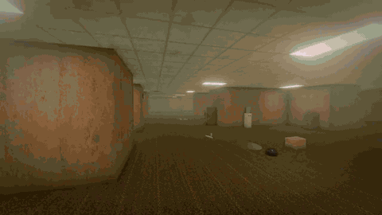

# Liminal Drift

A first-person walking game about liminal spaces, built with [three.js](https://threejs.org/).
There is nothing to win. You drift from one empty place to the next.

**Play:** https://danishi.github.io/liminal-space/

[](https://danishi.github.io/liminal-space/media/gameplay.mp4)

▶ **Gameplay** (80 s, 1280×720, in-game sound, all ten levels): [watch on GitHub Pages](https://danishi.github.io/liminal-space/media/gameplay.mp4)
· [public/media/gameplay.mp4](public/media/gameplay.mp4)

▶ **Highlight reel** (38 s, 1280×720, with sound): [watch on GitHub Pages](https://danishi.github.io/liminal-space/media/highlight.mp4)
· [public/media/highlight.mp4](public/media/highlight.mp4)

Characters are sculpted in code, signs and posters are painted on canvas, every sound is synthesised
with the Web Audio API, and the photo-scanned textures and models are CC0 assets from Poly Haven.

## How it works

- Each level is picked at random and built procedurally, so no two visits look the same.
- **Choose a level** on the title screen to start in a particular one, and optionally deeper in (as if
  you had already drifted a few times). From there you drift at random as usual.
- You leave a level when its **signal** (top right) fades out, when you walk through a **door that hums**
  (the light behind it hints at where it leads), or when you **fall**: into a hole, or through a floor
  that gives way.
- **Levels come apart.** As the signal fades, the level crumbles from its far edges toward you: cracks
  run across the floor, walls and ceiling, lights stutter, grit sifts down, then whole stretches drop
  into the void and their pieces tumble after them. When the signal is gone, so is the floor under your
  feet. Before that, cracked patches of floor give way a moment after you step on them, and now and
  then a rumble takes out a stretch of level nearby, usually behind you. The deeper you go, the more of
  both. Residents, apparitions and doors caught in it fall too.
- Levels have height: stairs, sunken rooms, raised decks, platforms and pits.
- **Unease** grows with every level you pass through and with distance from where you arrived. The
  deeper you go, the more cluttered and wrong things get: more props and stranger ones, dead and
  flickering lights, murkier water, greyer skies, more holes, and apparitions that stand and watch.
  They never hurt you.
- Some residents will talk to you.
- **Crossed signals:** once you've drifted a few times, a level may have a patch of somewhere you've
  already been leaking into it. Walls, floor and ceiling from the other level show through in corrupted
  blocks, its furniture turns up, one of its residents wanders in looking confused, its ambience bleeds
  over this one and the HUD can't decide which level you're on.

## Residents and apparitions

Every character is sculpted in code: signed-distance primitives (spheres, ellipsoids, round cones,
boxes, tori) are blended with smooth unions and carved with smooth subtractions, then turned into a
mesh with narrow-band surface nets. Each primitive carries a paint region and a bone, so the same pass
gives vertex colours, per-vertex roughness and automatic skin weights. Heads and hands are sculpted at
a finer resolution and ride on their bones; eyes are real glossy eyeballs. Characters are animated
procedurally (walk cycles, breathing, head tracking, poses) and pick up the level's baked light through
a light probe.

- **The Watcher** stands at the end of hallways. Its head follows you further than a neck should
  turn, it tilts at the wrong moments, and if you stare long enough it gives you a slow, polite wave.
  Deeper in, one walks upside down along the ceiling.
- **Mannequins** only move when nobody is looking. Each time you look back they're closer and posing
  differently: peace signs and dabs while things are calm, reaching for you when they aren't. If one
  gets right behind you and you turn round, it falls to pieces. You can poke them.
- **Something peeks round corners** and ducks back when you look straight at it.
- **The grin** in the dark hotel has a mouth full of teeth; shine your light on it and it shakes its
  head very fast before it goes.
- **A cat** turns up where you're about to look, loafing or sitting, and sometimes on the ceiling.
  You can pet it.
- **A robot vacuum** has been cleaning the same room since 1998. Far enough out, it follows you.
- Residents: the Drifter (asleep in a hazmat suit, snoring through the mask), a ghostly bellboy who
  bows, a station attendant who bows properly, students made of dusk, a white fox that sits like a
  shrine statue, a mall guard asleep on the job, a parking attendant, a bathhouse keeper and his
  capybaras. Residents of one level sometimes wander into another through a crossed signal, and are
  not happy about it.

## Levels

| Code | Level | Mood | Residents and things |
| --- | --- | --- | --- |
| LEVEL 0 | The Backrooms | Sterile, uneasy | The Drifter, a ringing phone, a tall figure at the ends of hallways |
| LEVEL 37 | The Poolrooms | Bright, calm | The Big Duck, little ducks you can poke, deep ends you can sink into |
| LEVEL 3.14 | Pastel Dreamscape | Bright, whimsical | Mochi residents, holes that open onto the sky |
| LEVEL 188 | After-School Hallways 黄昏の校舎 | Nostalgic (Japan) | Students who stayed behind; after the chime, someone walks the halls |
| LEVEL 8 | Last-Train Underpass 終電後の地下通路 | Fluorescent, empty (Japan) | The station attendant; don't step onto the tracks |
| LEVEL 1000 | Thousand Gates 千本鳥居 | Mystical, night (Japan) | The white fox, stone lanterns, a thousand torii |
| LEVEL 11 | The Night Hotel | Dark, eerie | The bellboy, a grin in the dark |
| LEVEL 94 | The Dead Mall | Warm, hollow | A security guard asleep at his desk, display mannequins that change pose, stopped escalators, a kiddie ride that plays to nobody, odd PA announcements |
| LEVEL 6 | Parking Level P6 | Sodium-dark | The parking attendant and his barrier, cars that lock themselves as you pass, a car that honks a tune, a driverless car that creeps closer when you look away |
| LEVEL 26 | Midnight Bathhouse 深夜の銭湯 | Steamy, Shōwa (Japan) | The keeper on the bandai, capybaras soaking with yuzu, yellow ユアミン bath buckets, a Fuji mural that goes wrong the further you go |

## Controls

| Input | Action |
| --- | --- |
| `↑` `↓` / `W` `S` | Walk forward / back |
| `←` `→` | Turn (you can play with the keyboard only) |
| `A` `D` | Step sideways |
| Mouse | Look around (click to capture the pointer) |
| `Shift` | Run |
| `E` / `Space` / left click | Talk, interact, continue dialogue |
| `F` | Flashlight (where available) |
| `M` / `Tab` | Map |
| `Esc` / `P` | Pause |

- **Steering assist** (Settings: Off / Low / Medium / High): while you walk and aren't looking around
  by hand, the view follows the open path around corners and levels itself.
- **Touch:** drag on the left half to move, on the right half to look; on-screen buttons for run,
  interact, light and map.
- **Gamepad:** left stick moves, right stick looks, A interacts, RB/RT runs, Y toggles the light,
  Start pauses, Back opens the map.

Settings (look sensitivity, field of view, volume, graphics quality, steering assist, minimap,
inverted look, head bob, reduced screen effects, FPS counter) are saved in the browser.

## Graphics

- Photo-scanned materials and models (Poly Haven, CC0): carpet, wallpaper, tiles, plaster, linoleum,
  bamboo, stone paths; desks, chairs, sofas, payphones, lanterns, rocks and more, at real-world scale
- Real HDRI skies and window views (the school's windows look out on a photographed suburb)
- Procedural PBR surfaces for everything else (normal and roughness maps generated on canvas)
- Baked lighting: when a level is built, every fixture's light (blocked by walls), a bounce term and
  ambient occlusion are computed per vertex, so the whole level is lit, not only the lights near you
- Flashlight shadows in dark levels (Medium and High)
- Reflection probe (PMREM) captured at the arrival point; on High it is re-captured as you move
- Ground-truth ambient occlusion (GTAO) on Medium and High
- Rectangular area lights for fluorescent panels, pooled so only the nearest fixtures are real lights
- AgX / neutral tone mapping, bloom, and a camcorder pass (grain, vignette, chromatic aberration)
- Static props are merged per material, so hundreds of props cost only a few draw calls
- Collapse: every level material looks its grid cell up in a small data texture, so cells crack,
  shiver and vanish with ragged edges; the debris is instanced slabs of the real floor, wall and
  ceiling materials

## Credits

Textures, models and HDRIs are from [Poly Haven](https://polyhaven.com) and are CC0 (public domain).
`scripts/fetch-assets.mjs` downloads them and optimizes them into `public/assets/`.

## Development

```bash
npm install
npm run dev      # http://localhost:5173
npm run build    # outputs dist/
npm run preview
```

## Deployment

`.github/workflows/deploy.yml` builds and deploys `main` to GitHub Pages on every push to `main`. Pages must use **Settings → Pages → Source: GitHub Actions**.

## Project layout

```
src/
  core/      grid (2.5D height field), SDF sculpting (surface nets, auto skinning), procedural
             surfaces and textures, audio, input, post-processing, light pool
  game/      game loop and drifting, player (steering assist, gravity), world (collision, unease, doors),
             crossed signals (levels bleeding into each other), collapse (levels coming apart) and debris
  entities/  sculpted characters (figures: humanoid and quadruped rigs, poses; looks: the cast),
             residents (NPC), doors to other levels, apparitions
  props/     prop kit (batched merging), prop library, canvas-painted signs and posters
  stages/    one module per level (the larger levels are folders of modules), loaded on demand from
             the registry in index.js, plus shared shell/decoration helpers
  ui/        screens, HUD, maps
```

## License

This is a personal hobby project, made for my own enjoyment. It comes as is, with no warranty or
support, and issues and pull requests may be looked at whenever I get round to them (or not at all).

The code is released under the [MIT License](LICENSE). The Poly Haven textures, models and HDRIs in
`public/assets/` are CC0 and stay CC0. The licences of bundled dependencies (three.js, MIT) are
written to `third-party-licenses.md` in the build output.
